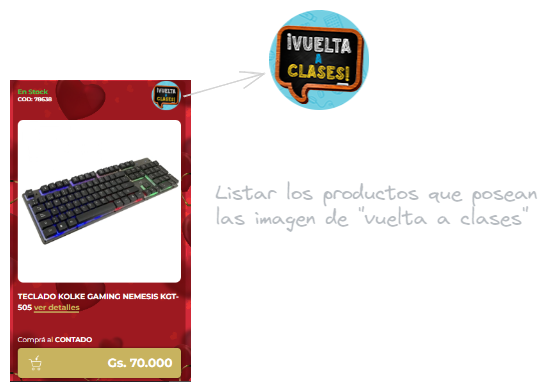

# Web Scraping con Selenium

Este es un proyecto de web scraping utilizando Selenium para extraer información de la página web [www.tupi.com.py](https://www.tupi.com.py/).

## Descripción

El objetivo de este script es buscar productos de la categoría "teclados" (ejemplo) con la etiqueta "vuelta a clases" en el sitio web de Tupi y extraer información relevante, como el nombre del producto, el precio y el enlace correspondiente.

## Requisitos

- Python 3.x
- Selenium
- WebDriver (en este caso, se utiliza ChromeDriver)

## Instalación

1. Clona este repositorio en tu máquina local: 

`git clone https://github.com/AlexArce2000/web-scraping-selenium.git
`

2. Instala las dependencias necesarias:

`pip install selenium
`

3. Descarga el WebDriver correspondiente para tu navegador (en este caso, ChromeDriver) y asegúrate de que esté en tu PATH.

## Uso

1. Ejecuta el script `web_scraping.py`:

`python web_scraping.py
`

2. El script abrirá una ventana del navegador, realizará la búsqueda de teclados en el sitio web de Tupi, y mostrará la información extraída en la consola.

## Ejemplo de la página

Los ejemplos fueron realizados en la fecha actual.

###### Página al momento de realizar el script: 

[https://postimg.cc/NKYdXRVc
](https://https://postimg.cc/NKYdXRVc)

###### Salida:

https://postimg.cc/7bw1mq93